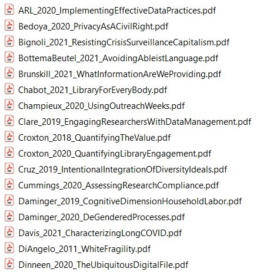

# File Organization and Naming

## Set Up a File Organization System {#file-organization}

***Description:*** *Implementing a file organization system is the first step toward creating order for your research data. Well-organized files make it easier to find the data you need without spending lots of time searching your computer. Every researcher organizes their files slightly differently, but the actual organizational system is less important that having a place where all of your files should logically go. This exercise prompts you to brainstorm organizational grouping and hierarchies to come up with an order for managing your research data.*

***Instructions:*** *This is a card-sorting exercise, meaning you will need a stack of note cards or post-it notes to do this activity. Follow the instructions to label cards and move them around until you develop your organizational system. There is no one correct way to do this so feel free to play around, add new cards, and move cards however you want! Once you put your new organizational system into place, be sure to always put your files where they're supposed to go.*

---

1. Take a stack of notecards or post-it notes and write the following labels on them, omitting any file types that you do not use in your research:
	* Raw data
	* Analyzed data
	* Code
	* Protocols
	* Article drafts
	* Figures
	* Your publications
	* Literature PDFs
	* Grant documents
	* Research notes
2. Move cards around and group together files that you want to store together.
3. Create hierarchies in organization, such as for organizing files by project or by date, by adding new "folder" cards and moving existing cards/groups of cards underneath them. Label these new cards as appropriate.
4. Make copies of any cards, as needed, and adjust placement and hierarchies until you are happy with the organizational system you developed.
5. Record your organizational system in your lab notebook or in a [README.txt](#readme-txt).

## Create a File Naming Convention {#file-naming}

***Description:*** *File naming conventions are a simple way to add order to your files and help to find them later. Rich and descriptive file names make it easier to search for files, understand at a glance what they contain, and tell related files apart.*

***Instructions:*** *This exercise guides researchers through the process of creating a file naming convention for a group of related files. Fill in each section for a group of related files following the instructions; an example for microscopy files is provided. This exercise may be redone as needed, as different groups of files require different naming conventions.*

***Source:*** *This exercise is based on the "File Naming Convention Worksheet" [@briney_file_2020].*

---

**1. What group of files will this naming convention cover?**

You can use different conventions for different file sets.

*Example: This convention will apply to all of my microscopy files, from raw image through processed image.*

&nbsp;

&nbsp;

&nbsp;

**2. What information (metadata) is important about these files and makes each file distinct?**

Ideally, pick three pieces of metadata; use no more than five. This metadata should be enough for you to visually scan the file names and easily understand what’s in each one.

*Example: For my images, I want to know date, sample ID, and image number for that sample on that date.*

1.
2.
3.
4.
5.

**3. Do you need to abbreviate any of the metadata or encode it?**

If any of the metadata from step 2 is described by lots of text, decide what shortened information to keep. If any of the metadata from step 2 has regular categories, standardize the categories and/or replace them with 2- or 3-letter codes; be sure to document these codes.

*Example: Sample ID will use a code made up of: a 2-letter project abbreviation (project 1 = P1, project 2 = P2); a 3-letter species abbreviation (mouse = “MUS”, fruit fly = “DRS”); and 3-digit sample ID (assigned in my notebook).*

&nbsp;

&nbsp;

&nbsp;

**4. What is the order for the metadata in the file name?**

Think about how you want to sort and search for your files to decide what metadata should appear at the beginning of the file name. If date is important, use ISO 8601-formatted dates (YYYYMMDD or YYYY-MM-DD) at the beginning of the file names so dates sort chronologically.

*Example: My sample ID is most important so I will list it first, followed by date, then image number.*

1.
2.
3.
4.
5.

**5. What characters will you use to separate each piece of metadata in the file name?**

Many computer systems cannot handle spaces in file names. To make file names both computer- and human-readable, use dashes (-), underscores (\_), and/or capitalize the first letter of each word in the file names.

*Example: I will use underscores to separate metadata and dashes between parts of my sample ID.*

&nbsp;

&nbsp;

&nbsp;

**6. Will you need to track different versions of each file?**

You can track versions of a file by appending version information to end of the file name. Consider using a version number (e.g. “v01”) or the version date (use ISO 8601 format: YYYYMMDD or YYYY-MM-DD).

*Example: As each image goes through my analysis workflow, I will append the version type to the end of the file name (e.g. “\_raw”, “\_processed”, and “\_composite”).*

&nbsp;

&nbsp;

&nbsp;

**7. Write down your naming convention pattern.**

Make sure the convention only uses alphanumeric characters, dashes, and underscores. Ideally, file names will be 32 characters or less.

*Example: My file naming convention is “SA-MPL-EID\_YYYYMMDD\_###\_status.tif” Examples are “P1-MUS-023\_20200229\_051\_raw.tif” and “P2-DRS-285\_20191031\_062\_composite.tif”.*

&nbsp;

&nbsp;

&nbsp;

**8. Document this convention in a README.txt (or save this worksheet) and keep it with your files.**

&nbsp;

&nbsp;

&nbsp;
